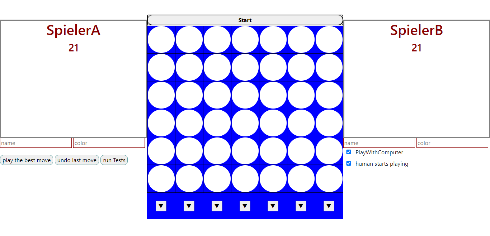

# VierGewinnt (PiS, SoSe 2020) 

Autor: Mohammad Alayoub | Matrikelnummer: 5275160

Ich habe die Zulassung für PiS im WiSe/SoSe 2020 bei Herrn Herzberg erhalten.

###Inhaltsverzeichnis:

##   Einleitung
Hier finden Sie das Spiel VierGewinnt. Der Code ist in Kotlin geschrieben. Mithilfe von Javalin ist die Oberfläche des Spieles in HTML dargestellt. 
Man findet alle Dateien sowie Bilder, was dieses Spiel und ihre Implementierung angeht in diesem Ordner.

### Spielregeln
Es können maximal zwei Spieler mit diesem Spiel spielen. Die zwei Spieler stecken ihre Spielsteine abwechslend in die Spielfelder. jeder Spieler hat eine eigene Farbe, mit der seine Spielsteine aufgefüllt sind.
Das Spielbrett hat 42 Spielfelder und jeder Spieler hat genau 21 Spielsteine, die er in die Spielfelder stecken kann. 
Die Spielsteine werden immer in das erste freie Spielfeld einer Spalte gesteckt(Das erste Spielfeld einer Spalte bedeutet das erste, wenn unten angefangen wird). 
Das heißt also, wenn das erste Spielfeld der ersten Spalte frei ist, so kann das Spielstein nur in das zweite Spielfeld gesteckt werden.
Ein Spieler hat gewonnen, wenn er vier seiner Steine in einer Reihe, Spalte oder Diagonale hat. Das Spiel endet unentschieden, wenn alle Felder besetzt sind, und keiner der zwei Spieler 4 Steine in einer Spalte, Reihe oder Diagonale hat.

### Bedienungsanleitung

Das Spiel ist unter localhost:7070 abrufbar.                
#####Start-Taste: 
Ein Spiel kann gestartet werden, wenn man auf die Taste start drückt, die sich genau über dem Spielbrett befindet. jedes Mal, wenn man auf diese Taste drückt, wird ein neues Spielbrett generiert, also egal ob ein Spiel schon gestartet wurde oder nicht.
Links und Rechts sind die Bereiche der Spielerinformationen, wo der Name des jeweiligen Spielers und wie viele Spielsteine er noch hat, angezeigt werden. Diese Bereiche werden später
mit der Farbe des Spielers aufgefüllt.
#####Textfelder für Spielerinformationen: 
Unter jedem Spielerbereich befinden sich 2 Textfelder, in die man den gewünschten Namen sowie die gewünschte Farbe eintragen kann. Also die Textfelder links geben die Infos des linken Spielers an, und das ist genau so bei der rechten Seite.
Bitte achten Sie drauf, dass, wenn man keine Daten in die Textfelder eintragt, die Standard Informationen automatisch genommen werden, diese sind (linker Spieler: Name = SpielerA, Farbe = gelb | rechter Spieler: Name = SpielerB, Farbe = Schwarz).
Die Informationen werden nur beim Starten eines neuen Spieles übernommen. Also wenn Sie einen neuen Namen oder eine neue Farbe möchten, dann müssen Sie die gewünschten Daten in die jeweiligen Textfelder eintragen und ein neues Spiel starten.
#####Spiel-Tasten: 
Unter dem Spielbrett befinden sich 7 Tasten, die mit Pfeilen beschriftet sind, mit diesen kann man sein Spielstein in das Spielfeld der jeweiligen Spalte stecken. Wenn man also auf eine Taste drückt, so wird ein Spielstein in das erste freie Spielfeld der jeweiligen Spalte gesteckt.
Wenn eine Spalte voll ist, so reagiert das Programm nicht, wenn die Taste dieser Spalte betätigt wird. Ist das Spiel zu ende (ein Spieler hat gewonnen oder unentschieden(siehe Spielregeln)) oder hat man noch gar kein Spiel begonnen, so sind alle 7 Tasten nicht anklickbar. Es sei dann, es wird ein neues Spiel generiert, indem man auf start drückt(siehe oben).

Auf der linken Seite unter den Textfeldern befinden sich drei Tasten (play the best move, undo last move, run tests).

#####play the best move: 
mithilfe dieser Taste kann man den Computer einsetzen, den besten für den Mensch Zug zu spielen. Also wenn Sie dran sind, dann können Sie wenn gewünscht diese Taste betätigen und der Computer spielt automatisch den besten Zug für Sie.
Bitte beachten Sie, dass das Spiel so implementiert ist, dass immer 2 Spieler abwechslend spielen. Das heißt also, wenn der Computer einen Zug für Sie spielt, dann spielt er auch direkt einen Zug für sich. Also egal wie und was man betätigt, es können keine zwei Züge vom selben Spieler hintereinander gespielt werden.
Man kann es aber vermeiden, dass der Computer automatisch einen Zug spielt(siehe unten 'play with computer').

#####undo last move: 
   mit dieser Taste kann man den letzten Zug rückgängig machen. Bitte beachten Sie den folgenden Fall: wenn Sie dran sind und Sie den letzten Zug rückgängig machen, dann machen Sie den Zug, welchen der Computer gespielt hat, rückgängig. das führt dazu, dass der Computer sofort einen Zug spielt, weil er dran ist. (Man kann es aber vermeiden, dass der Computer automatisch einen Zug spielt(siehe unten 'play with computer')). 

#####run Tests: 
mit dieser Taste lassen sich 5 Tests ausführen. Die Ergebnisse werden auf der Konsole angezeigt. Die Tests sind in diesem Dokument werden die Tests beschrieben(siehe unten Tests):

Auf der rechten Seite befinden sich unter den Textfeldern zwei Checkboxes(play with computer, human starts playing). Die sind immer angekreuzt, es sei denn, Sie hacken den gewünschten checkbox ab:
* #####play with computer: 
    Das Spiel kann sowohl mit einem Computer als auch mit einem anderen Mensch gespielt werden. Also wenn Sie es wollen, dass der Computer spielt, dann muss der Checkbox angekreuzt sein. 
Für ein besseres Bedienen ist es so implementiert, dass man diesen checkbox beliebig an- und abhacken kann. Der Computer spielt also nur, wenn dieser checkbox angekreuzt ist. Also egal ob Sie am Anfang des Spieles sind oder schon Züge gemacht worden sind, Sie können diesen Checkbox immer an- oder abhacken, und entsprechend Ihrem Wunsch spielt der Computer.
Dieser Vorteil wird bei anderen Funktionalitäten, wie undo last move usw. helfen (siehe oben). Ein Zug des Computers kann maximal bis zu 4 Sekunden dauern. Es ist aber nur in wenigen Fällen der Fall. Es kann in vielen Fällen dank der Datenbank in weniger als einer Sekunde ein Zug gespielt werden.

* #####human starts playing: 
    Diese hilft dem Nutzer festzulegen, wer den ersten Zug spielt. Bitte beachten Sie, dass diese Eigenschaft nur genutzt werden kann, bevor ein neues Spiel gestartet wird. Das heißt also, wenn Sie Z.B. ein Spiel gestartet haben und diesen Checkbox an- oder abhacken, 
dann ist das nur für das nächste Spiel gültig und wird nur beim nächsten Spiel übernommen.

###Hinweise zum Nutzverhalten:
* Vermeiden Sie es, Tasten zu betätigen, während der Computer am Spielen ist, um Programmstürzen zu vermeiden.
* Halten Sie sich bitte an die oben genannten Regeln, um Fehler zu vermeiden.

### Dateiübersicht

    /build.gradle
    /evaluated_Boards.txt
    /Readme.md
    /Screenshot.PNG
    /TranspositionTable.txt
    /src/main/resources/public/index.html
    /src/main/resources/public/script.js
    /src/main/resources/public/style.css
    /src/main/kotlin/App.kt
    /src/main/kotlin/Board.kt
    /src/main/kotlin/Computer.kt
    /src/main/kotlin/Database.kt
    /src/main/kotlin/Game.kt
    /src/main/kotlin/MiniMax.kt
    /src/main/kotlin/Place.kt
    /src/main/kotlin/Spieler.kt
    /src/main/kotlin/Test.kt
    /src/main/kotlin/TranspositionTable.kt
    
    -------------------------------------------------------------------------------
    Language                     files          blank        comment           code
    -------------------------------------------------------------------------------
    Kotlin                          10             99            237            684
    XML                              7              0              0            392
    HTML                             2              2              0            335
    Markdown                         1            106              0            333
    Bourne Shell                     1             21             36            126
    JavaScript                       1             10             20             93
    CSS                              1              0              0             88
    DOS Batch                        1             24              2             74
    Gradle                           2              5              0             21
    SQL                              1              0              0              2
    -------------------------------------------------------------------------------
    SUM:                            27            267            295           2148
    -------------------------------------------------------------------------------

## Spiel-Engine (ENG)

    Feature    |  M  |  H  | MC  | eD  | B+I | Summe
    -----------|-----|-----|-----|-----|------|----
    Umsetzung  | 100 | 70  | 100 | 130 | 66.6 |
    Gewichtung | 0.4 | 0.3 | 0.3 | 0.3 |  0.3 | 
    Ergebnis   |  40 |  21 |  30 | 39  |  20  | **150%**
--------------------------------------------------------

    Hinweis: jede Klasse und jedes Interface ist in einer extra Datei mit einem deutlichen Namen zu finden.
 
Die Spiel-Engine-Class ist in der Datei Computer.kt zu finden. Da sind die verschiedenen Funktionen einer Spiel-Engine implementiert.
#####Computer:
    Diese Klasse hat einen privaten Konstroktur, deshalb kann es kein Objekt direkt ausserhalb von ihr erzeugt werden. Sie implementiert das Interface MiniMax(siehe unten Interface MiniMax).
    Sie enthält folgende Methoden:
* statische Methoden: Es ist so gedacht, dass man ausserhalb der Computer-Class gar nicht auf die Methoden und Funktionen zugreifen kann. Deshalb sind zwei statischen Methoden innerhalb der 
Klasse Computer implementiert, die dazu dienen, den Computer einzusetzen, um irgend  welche Aufgaben zu erledigen. Diese Methoden sind innerhalb des Companion Object Bereiches zu finden:
    * new_move: damit kann man den Computer einsetzen, einen besten Zug zu berechnen. Innerhalb dieser Methode wird ein neues Objekt von Computer erzeugt, um die Methode bestmove aufzurufen. Also angenommen Sie wollen einen besten Zug berechnen lassen, dann brauchen Sie nichts anders als diese Methode mit folgenden
     Informationen (gewünschte Tiefe, die ID des Spielers und das Board), dann wird alles andere automatisch gemacht, um Ihnen die beste Spalte, in die Sie Ihren Spielstein stecken können, zu verraten. Diese Methode gibt den gefundenen Spaltenindex zurück.
    
    * new_test: Diese Methode ist dafür verantwortlich, die 5 Tests auszuführen(siehe unten Tests). In dieser Methode wird ein neues Objekt vom Computer erzeugt, um den Minimax-Algorithmus aufzurufen und den jeweiligen Test zu überprüfen.
    Sie wollen also einen Test ausführen?. Alles was dafür benötigt wird, ist diese Methode mit dem Board und der gewünschten Tife aufzurufen. Diese Methode gibt die möglichen Züge mit der jeweiligen Bewertung, eine Liste mit Boolean-Werte(ob der 4 oder 5 Test erfolgreich waren) und der Darstellung des Boardes.
    
* bestmove: wird von der statischen Methode new_move aufgerufen und ist dafür verantwortlich den Minimax-Algorithmus aufzurufen und die möglichen Züge mit den Bewertungen zu filtern, um den besten Zug für den Spieler, der gerade am Ziehen ist, auszuwählen.
Innerhalb dieser Methode wird das Board mit dem besten Zug und seiner Bewertung in die Datenbank gespeichert, falls das Board noch nicht in der Datenbank gespeichert ist(Sie können auch die storedBoards komplett in die Datenbank speichern, das war aber meiner Meinung nach viel besser, das Board nach der Berechnung des besten Zuges zu speichern, so kann man sich sicher sein, dass der Zug, der bei diesem Board ausgewählt wurde, wirklich der beste ist).
Da der Mensch den Computer einen besten Zug für sich berechnen lassen kann, wird nach dem Aufruf des Minimax-Algorithmuses zwischen min und max unterschieden. Im Falle des Computerzuges wird der Zug mit der höchsten Bewertung gewählt. Genau der Gegensatz ist beim Zug des Gegners, da wird der Zug mit der kleinsten Bewertung gewählt.

* runtest: wird von der statischen Methode new_test aufgerufen und ist dafür verantwortlich, den Minimax-algorithmus aufzurufen, um die Tests zu überprüfen.

* evaluate: wird von dem Minimax-Algorithmus aufgerufen und ist dafür verantwortlich, ein Board mithilfe der Monte-Carlo-Methode zu bewerten. Achtung: das geschieht, nachdem geprüft wird, ob ein Spieler bereits gewonnen hat. weil es macht keinen Sinn, die Monte-Carlo-Methode zu verwenden, wenn bereits ein Spieler gewonnen hat.
Falls das nicht der Fall ist, wird die größte Anzahl von gewonnenen Spielen als Bewertung des aktuellen Boardes zurückgegeben.
Mit der Variable number kann man die Anzahl der Spiele, die in der Monte-Carlo-Methode gespielt werden, festlegen.

* evaluateMoves: Diese Methode wird von der evaluate-Methode aufgerufen. Diese ist dafür verantwortlich, zu überprüfen, wie oft gewonnen wird, wenn einer der möglichen Züge gespielt wird. Sie ruft die Methode simulatePlays und gibt die Anzahl der gewonnenen Spiele bei jedem möglichen Zug zurück.

* simulatePlays: Diese Methode wird von der evaluateMoves-Methode aufgerufen und ist dafür verantwortlich die Methode playrandomly aufzurufen. das geschieht soviel, wie die number-Variable(die Anzahl der Spiele) groß ist.
Sie erhöht, je nachdem, wie das Spiel endet, die Anzahl von gewonnenen, verlorenen oder unentschiedenen Spielen um eins, und gibt die Ergebnisse zurück. Das Array count enthält drei Zahlen(wie oft verloren, wie oft unentschieden, wie oft gewonnen).
In dieser Methode wird eine gefertigte Kopie des Spielbrettes gemacht.

* playrandomly: Diese Methode wird von simulatePlays aufgerufen und ist dafür verantwortlich, ein Spiel auszuführen. Sie generiert Zufallszüge und führt sie aus. Das ganze macht sie solange, bis Einer gewinnt oder das Spiel endet unentschieden.

* VierinReihe: überprüft, ob ein Spieler gewonnen hat und gibt 1(Computer hat gewonnen), -1(Mensch hat gewonnen) und 0(keiner hat gewonnen), je nachdem welcher Spieler gewonnen hat. Das geschieht dadurch, dass innerhalb der Board-Class überprüft wird, ob in einem der Bitboards Vier Einsen in einer Reihe, Spalte oder Diagonale, sind.

#####Interface MiniMax.kt

    Dieses Interface stellt die Spiel-Engine dar und wird von der Computer-Class implementiert.
    Es enthält folgende Methoden:
    
 * evaluate: siehe oben (Computer -> evaluate)
 * bestMove: siehe oben (Computer -> bestMove)
 * hashBoard: gibt den Hashwert eines Spielbrettes mithilfe von Zobrist-Hashing(siehe unten TranspositionTable.kt) zurück
 * Minimax:
  
        Hinweis: Bitte haben Sie dafür Verständnis, dass etwas in der Beschreibung fehlen könnte. Deshalb kann es von Vorteil sein, einen Blick auf den Code zu werfen.
        
    Ist der rekursive Algorithmus, der dafür verantwortlich ist, den Spielbaum aufzubauen, um den besten Zug zu übermitteln. 
    Am Anfang des Algorithmuses wird geprüft, ob die Züge die Blätter sind(depth = 0), wenn das der Fall ist, dann müssen wir die Spielstellung bewerten.
    Dann wird geprüft, ob das aktuelle Board schon bewertet wurde, also in der HashMap storedBoards beim selben Aufruf des Algorithmuses oder in der Datenbank, wenn das der Fall ist, 
    dann muss das Board nicht nochmal bewertet werden und der Zug und seine Bewertung müssen zurückgegeben werden.
    Der Algorithmus besteht aus zwei Teilen, die mit zwei if-Verzweigungen dargestellt sind.
    
    * die erste: wenn turn = 1, also wenn der Computer(Maximizing player) dran ist, welcher versucht zu maximieren.
    innerhalb dieser Verzweigung werden alle für den Computer mögliche Züge ausgeführt. Der Zug wird gemacht und dann wird minimax sich rekursiv aufrufen mit turn = -1,
     um den Mensch seinen Zug machen zu lassen. siehe [Wikipedia](https://de.wikipedia.org/wiki/Minimax-Algorithmus). Hier wird die Bewertung eines Zuges bestimmt, und in die HashMap moves_scores gespeichert. um später in der bestMove-Methode den besten Zug von allen zu finden.
        Wenn dieser Fall eintritt, dann ist es der Fall, dass der Computer gewonnen hat. Es macht also keinen Sinn mehr weiterzusuchen und die For-Schleife, die die Züge einzeln durchläuft, wird mit break beendet.
        
            if (currentscore > 1000)
                break
        Beim folgenden Code wird festgestellt, ob gewünschtetiefe = 5 ist und der Testmodus = true, dann ist der Test 5 (siehe unten Tests) erfolgreich und brauchen nicht weiterzusuchen.
        
            if (gewuenshctetiefe == 5 && is_a_Test && !tests_results[4]){
                 tests_results[4] = true
                 boardString = board.toString()
                 break
            }
        
         * die zweite: genau das gleiche wie in der ersten Verzweigung geschieht hier, nur mit dem Unterschied, dass der Spieler minimieren will (Minimizing Player). Hier werden auch keine Züge gespeichert, wie in der ersten.
         
        Am Ende wird das Board in die HashMap storedBoards, je nachdem welcher Spieler dran ist, mit dem Wert min oder max gespeichert, um später wiederholte Bewertung zu vermeiden.
        
            Hinweis: Es ist in der Implementierung ganz klar zu sehen, dass String-Darstellungen verwendet werden. Obwohl die Interaktion in HTML geschieht. 
            Es war so gedacht, dass man sowohl über html als auch über die Konsole spielen kann. Sie benötigen dafür, nur eine kleine Implementierung der Interaktion über die Konsole.
            Deshalb habe ich es so implementiert, dass man das Board auf der Konsole angezeigt bekommen kann und zwar über einen Befehl (siehe unten Board).
            
 #####Board.kt
     Hier wird das Board und seine Funktionen implementiert. Es werden Bitboards verwendet, um die Effizienz der Implementierung zu erhöhen.
 Für mehr Infos über Bitboards [siehe hier](https://github.com/denkspuren/BitboardC4/blob/master/BitboardDesign.md)
 Die Boards sind mit Long Zahlen dargestellt.
 Die Klasse Board enthält folgende Methoden: 
 * make_move: um einen Zug zu machen. Das läuft alles über Bits(siehe Link oben für mehr Infos).
 * undo_move: um einen Zug rückgängig zu machen. Das läuft auch über Bits(siehe Link oben für mehr Infos).
 * list_moves: listet alle möglichen Züge(siehe Link oben für mehr Infos)
 * iswin: überprüft, ob ein Bitboard(Long Zahl) vier Einsen in einer Spalte, Reihe oder Diagonale hat(siehe Link oben für mehr Infos).
 * randommove: ruft die Methode list_moves auf und gibt einen zufälligen Zug von diesen Zügen zurück.
 * isGameOver: Die Methode gibt true zurück, wenn es keine möglichen Züge mehr gibt.
 * isColumnFull: überprüft, ob eine Spalte voll ist. jede Spalte besteht aus einer Zahl in binärform. Z.B. die erste Spalte ist am Anfang 0, weil die erste Spalte besteht am Anfang nur aus Nullen. Wird ein Zug gemacht, so wird diese Zahl
 um eins erhöht. Die Zahl wird nach 6 Zügen = 6, da die Spalte in VierGewinnt aus 6 Reihen besteht, ist die Spalte mit der Zahl 6 voll. und so geschieht das bei den 
 anderen Spalten. Also wenn die Zahl der Spalte um 6 erhöht ist, so ist die Spalte voll. Das wird bei dieser Methode geprüft.
 * Long.toBinary: wandelt eine Long Zahl in die binäre Form um, um das Board später bei der toString-Methode darstellen zu können(siehe unten toString).
 * getMoveIndex: gibt den Reihenindex des letzten besetzten Spielfeldes zurück, um das Spielfeld besser identifizieren zu können. Wie oben beschrieben sind die Spalten über Zahlen darstellbar(siehe oben iscolumnFull). also wenn man die ursprüngliche Zahl einer Spalte von der aktuellen 
 Zahl substrahiert, dann bekommt man einen Index 0-6, und das ist der Index der Reihe, in der der letzte Zug gemacht wurde.
 * deepcopy: gibt ein neues Objekt von der Klasse Board zurück. Dabei wird der private Konstroktur verwendet, um die Werte in andere Variablen zu kopieren und mit dem neuen Objekt zurückzugeben.
 * toString: diese Methode gibt das Board als String zurück und zwar mit eindeutigen Bezeichnungen für den jeweiligen Spieler(X = Computer, O = Mensch). Bei dieser Methode werden die beiden Bitboards behandelt. Beim ersten Bitboard wird es(also die Long Zahl) in die binäre Form umgewandelt und danach werden alle Einsen mit X ersetzt. 
 Das ganze geschieht beim zweiten Bitboard genau so, nur die Einsen werden mit O statt mit X ersetzt. Dananch werden die beiden Bitboards in ein einziges Board integriert und mithilfe von der Methode drawBoard(siehe unten drawBoard) gezeichnet.
 * drawBoard: Diese Methode wird von der toString-Methode aufgerufen und bekommt ein Board. Die Aufgabe dieser Methode ist es, die gespielten Züge richtig zu positionieren, dass das Board richtig angezeigt wird.
 Auf diese Weise hat man eine Darstellung des Boardes mit den beschrifteten(X, O oder -) Spielfeldern. Diese Funktion ist ein Vorteil beim Debuggen und auch in der Datenbank.
 
 #####Database.kt
    Um das Einlesen und Erzeugen von Textfiles zu vereinfachen, habe ich diese Klasse implementiert. Sie ist nichts anders als ein Tool, 
    um die Textdatei einfach zu steuern(also Daten speichern und auslesen). Es enthält folgende Methoden:
    
statische Methode:
* new: mithilfe dieser Methode kann eine neue Datei mit dem gegebenen Namen erstellt werden. Es ist dann als Dokument im Projekt-Verzeichnen zu finden.
    Bei dieser Methode wird zwischen zwei Fällen unterschieden.
     * Fall 1: Es existiert bereits eine Datei mit dem angegebenen Namen, so gibt die Methode diese Datei zurück und man hat dann die existierende Datei in der Variable drinnen.
     * Fall 2: Datei existiert nicht, so wird sie erstellt und zurückgegeben.
        
delete: löscht die Datei

writeToDatabase I: fügt ein zweidimensionales IntArray in die Textdatei hinzu.

    fun writeToDatabase(a: Array<Array<Int>>)
writeToDatabase II: fügt eine HashMap in die Textdatei hinzu

    fun writeToDatabase(a: HashMap<Int, Triple<Int,Int,String>>)
writeToDatabase III: fügt eine Zeichenkette in die Textdatei hinzu.

    fun writeToDatabase(s: String)
readContent: gibt den Inhalt der Textdatei zurück, genau so wie die Textdatei aussieht.

    fun readContent(): String
readHashMap: Da eine Datenbank in der Spiel-Engine implementiert ist, sind in einer Textdatei Spielbewertungen gespeichert, diese sind als HashMap in der Textdatei gespeichert worden, und müssen auch 
als HashMap zurückgegeben werden. 
In der Textdatei sind Hashcodes der jeweiligen Boards, Bewertung des Spielbrettes, der gewählte Zug und die Darstellung des Spielbrettes gespeichert.
Der dafür genutzte Befehl ist in der Computer-Class zu finden und sieht so aus: 

    override val database = Database.new("evaluated_Boards.txt").readHashmap()!!
    
readTranspositionTable: 
Diese Methode ist dafür verantwortlich, die TranspositionTable aus der Textdatei /TranspositionTable.txt auszulesen. Diese ist als zweidimensionales IntArray zurückzugeben.

    fun readTranspositionTable(): Array<Array<Int>>?
-----------------------------------------------------

    Hinweis: Bei allen read-Methoden, ist es so, dass null zurückgegeben wird, wenn keine passende Werte für den gewünschten Typ gefunden werden.
    
#####TranspositionTable.kt 
Sie haben bereits in der Computer-Class gelesen, dass es eine Methode gibt, den Hashcode eines Boardes zu berechnen. Diese Berechnung geschieht in dieser Klasse.
Sie ist also dafür verantwortlich, ein gegebenes Board zu hashen mit einem eindeutigen Hashcode. Das wurde in der Datenbank sowie in der HashMap storedBoard(siehe oben Computer) gebraucht, um ein Board eindeutig zu identifizieren.
Die verwendete Methode ist [Zobrist hashing](https://en.wikipedia.org/wiki/Zobrist_hashing).
Die Klasse enthält folgende Methoden:

* statische Methoden:
  * new_Hash: bekommt ein Board und gibt einen Hashwert zurück. Diese Methode nimmt die Darstellung des Boardes und ersetzt alle X's mit 0 und O's mit 1.
  Diese Werte werden dann mit anderen eindeutigen und zufälligen Int-Werten mithilfe der XOR-Operation verknüpft. Diese Zufallszahlen werden aus der Datei TranspositionTable.txt ausgelesen.
  Und somit erhält man immer den selben Hashwert, wenn zwei Boards miteinander übereinstimmen.
  
* inittable:
Mithilfe dieser Methode wird eine neue Tabelle mit zufälligen Int-Werten generiert und in die Textdatei /TranspositionTable gespeichert. Diese dient dann zum Hashen eines Boardes(siehe oben new).

## Tests (TST)

    Szenario |  1  |  2  |  3  |  4  |  5  | Summe
    ---------|-----|-----|-----|-----|-----|-------
    ok       |  X  |  X  |  X  |  X  |  X  | 1
------------------------------------------------------
    Hinweis: Bitte beachten Sie, dass bei Test 4 und 5 manchmal zu unerwarteten Zügen kommen kann, das wird unten noch genauer beschrieben. Ich entschuldige, dass ich hier im Voraus bei allen Tests angekreuzt habe und davon ausgehe
     dass Sie die Tests als richtig ansehen.
    
Die Tests werden wie folgt ausgeführt:

Über die graphische Oberfläche in HTML kann man mit der Taste run tests die Tests ausführen lassen(siehe Bedienung).

    Hinweis: Bitte beachten Sie, dass vor der Auslösung des Testmodus, der Computer am Ziehen sein muss. Also bevor Sie den Testmodus wählen, müssen Sie einen Zug spielen.
    In allen Fällen spielt der Computer direkt, deshalb müssen Sie dafür sorgen, dass sie den letzten Zug gemacht haben(siehe Bedienung -> play with Computer).

Die Testausführung protokolliert sich über die Konsole wie folgt:

    |----------------------------------------|
    |              Tests running...          |
    |----------------------------------------|
    
    Test 1
    Die Spiel-Engine kann im nächsten Zug gewinnen
    Der gewählte Zug ist im Spaltenindex 6
    
    ----------------------------------------------------
    Test 2
    Die Spiel-Engine vereitelt eine unmittelbare Gewinnbedrohung des Gegners
    Der gewählte Zug ist im Spaltenindex 6
    
    ----------------------------------------------------
    Test 3
    die Spiel-Engine kann im übernächsten Zug gewinnen
    Der gewählte Zug ist im Spaltenindex 6
    
    ----------------------------------------------------
    Test 4
    Die Spiel-Engine kann eine Drohung, die den Gegner im übernächsten Zug ansonsten einen Gewinn umsetzen lässt, vereiteln
    Das Board:
    -------
    -------
    -------
    X-O----
    O-O--O-
    X-OXXX-
    XOOXXOO
    
    ----------------------------------------------------
    Test 5
    Die Spiel-Engine kann im überübernächsten Zug gewinnen
    Das Board:
    -------
    -------
    O------
    X------
    O-O--O-
    X-OXXXX
    XOOXXOO
    
    ----------------------------------------------------
    |----------------------------------------|
    |              Tests finished...         |
    |----------------------------------------|
    
    es hat 24 Seconden gedauert

Die Tests:
* Die Spiel-Engine kann im nächsten Zug gewinnen: Hier wird geprüft, ob der Computer im nächsten Zug gewinnen kann. Und der Spaltenindex, wo der Zug gespielt wird, wird zusätzlich angezeigt.
* Die Spiel-Engine vereitelt eine unmittelbare Gewinnbedrohung des Gegners: hier wird geprüft, ob der Mensch im nächsten Zug gewinnen kann, und diese Drohung wird vom Computer vereitelt. Der Spaltenindex, wo der Zug gespielt wird, wird auf der Konsole angezeigt.
* die Spiel-Engine kann im übernächsten Zug gewinnen: Hier wird geprüft, ob der Computer im übernächsten Zug gewinnen kann. Hierzu wird auch der Spaltenindex auf der Konsole angezeigt. Hier kann manchmal zu unerwarteten Zügen kommen und das liegt daran dass, der Computer manchmal schlauere Züge findet, mit denen er unvermeidbar gewinnen kann.
* Die Spiel-Engine kann eine Drohung, die den Gegner im übernächsten Zug ansonsten einen Gewinn umsetzen lässt, vereiteln: Hier wird geprüft, ob der Mensch im übernächsten Zug gewinnen kann. Bitte beachten Sie, dass der Computer lieber gewinnen, als Drohungen vereiteln will, also wenn es bessere Züge gibt, die den Computer gewinnen lassen, dann werden diese bevorzugt behandelt.
In diesem Fall wird deshalb nur das Board angezeigt, auf dem zu sehen ist, wie das Spielbrett aussieht, wenn der Mensch gewinnen würde.
* Die Spiel-Engine kann im überübernächsten Zug gewinnen: Hier wird geprüft, ob der Computer im überübernächsten Zug gewinnen kann. Hier wird auch nur das Board angezeigt, auf dem zu sehen ist, wie der Computer gewinnen kann. Wie oben erwähnt, kann es dazu kommen, dass vom Computer andere Züge bevorzugt behandelt werden können, weil sie von der Sicht des Computers besser sind. Und deshalb kann es zu unerwarteten Zügen führen.
    
    
    Bitte beachten Sie, dass das Ausführen der 5 Tests je nachdem wie das Spielbrett aussieht, bis zu 2 Minuten dauern kann.
    
     
#####Test.kt (Test-Class)
In dieser Klasse werden die einzelnen Tests ausgeführt und mithilfe der Spiel-Engine überprüft. Das läuft über verschiedene Methoden:

* Statische Methode 
  * run_Tests: 
    sie ruft die Methode checkValues(siehe unten checkValues) fünf mal mit den Tiefen 1-5 und erstellt ein neues Objekt vom Test, welches ausgibt, ob der Test erfolgreich war.
    Also für jede Sichtiefe 1-5 wird die Methode checkValues aufgerufen und der jeweilige Test überprüft.
  * checkValues:
    ruft die statische Methode Computer.new_test, welche den Minimax aufruft, und die Spielpositionen mit den Bewertungen zurückgibt.
    Bei dieser Methode wird überprüft, ob die vom Computer zurückgegebenen Informationen die jeweiligen Testvoraussetzungen erfüllen.
    
## Umsetzung der GUI

Die Oberfläche ist mithilfe der Javalin-Bibliothek in HTML umgesetzt.   
Das Spielbrett ist mit einer Tabelle dargestellt. 
Um irgendeine Forderung an den Server zu stellen, muss man eine Taste betätigen, Z.B. um einen Zug zu spielen, muss die Taste der jeweiligen Spalte betätigt werden(siehe Bedienung). 
Nach der Auslösung wird ein XMLHTTPREQUEST an den Server geschickt mit der gewünschten Aufgabe, die der Server erledigen soll.
Um einen Zug zu spielen, betätigt man eine Play-Taste und somit wird den REQUEST geschickt. Der Client bekommt nach der Bearbeitung des Auftrages das Ergebnis(response text). 
Also er bekommt die jeweiligen bearbeiteten Infromationen, um sie dann umzusetzen. Bei einem Zug bekommt der Client die Position des gewünschten Zuges und dann wird der Kreis innerhalb des jeweiligen Spielfeldes mit der Farbe des spielenden Spielers aufgefüllt. Genau so funtioniert es bei den anderen Aufträgen.
In der App-Class geschieht die Kommunikation zwischen dem Client und dem Server. 
Die App-Class erhält die URL vom Client und realisiert, welcher Auftrag erledigt werden muss.

* newgame: Hier wird ein neues Spiel gestartet(siehe unten Game.kt). Hier bekommt der Server die Angabe, wer mit dem ersten Zug beginnt, und entsprechend dieser Angabe spielt der Computer oder der Mensch den ersten Zug.

* play: Hier wird ein Zug gespielt. Als Antwort erhält der Client die toString-Methode der App-Class. Die stellt folgende Informationen dar:
    * Position des gewählten Zuges: hier wird die Klasse Place als Hilfe verwendet. Sie hat einen Spalten- und Reihenindex und mithilfe dieser Koordinaten kann das gewählte Spielfeld identifiziert werden.
      Bei den Koordinaten werden die Indexe immer bei 1 anfangen.
    * Der Name des spielenden Spielers: (siehe unten Spieler.kt)
    * Die Farbe des spielenden Spielers: (siehe unten Spieler.kt)
    * Die Anzahl der übrigen Spielsteine, die der spielende Spieler hat: (siehe unten Spieler.kt)
    * Der Gewinner (hat ein Spieler gewonnen, so wird der Name des gewonnenen Spielers zurückgegeben, bei unentschieden wird unentschieden zurückgegeben, ansonsten wird null zurückgegeben): 
    Dementsprechend wird das Ergebnis-Display auf HTML aktualisiert.
    * Die ID des spielenden Spielers: damit der Client weiß, welcher Spieler behandelt werden muss, um die Displays auf HTML dementsprechend zu aktualisieren.
    * Die Zeit, wie lange es gedauert hat, den Zug zu machen: Dabei wird die aktuelle Zeit beim Erhalten der Forderung vom Client von der Zeit nach dem Bearbeiten des Auftrages substrahiert.
* test: Hier wird der Testmodus gestartet(siehe oben Tests). Weil die Ergebnisse auf der Konsole angezeigt werden, wird keine Antwort an den Client geschickt.       
* Computer: Hier wird der Computer seinen Zug spielen(siehe oben Spiel-Engine)
* undo: Hier wird ein Zug rückgängig gemacht.

Dabei wird alles in der Klasse App angepasst, Z.B. Welcher Spieler gerade dran ist usw.

#####Game.kt
In dieser Klasse geschieht die ganze Logik des Spieles. Sie ist die Schnittstelle oder Zentralstelle, in der die ganzen Aufträge an die dafür zuständigen Methoden geschickt werden.
Sie enthält folgende Methoden:
* Statische Methode:
  * new: Hier wird ein neues Spiel gestartet. Also es werden Spieler, Spielbrett(Board) und alles, was für ein Spiel benötigt wird, angelegt. 
   Entsprechend der Angabe des Benutzers wird der Spieler, der den ersten Zug macht, festgelegt.

* runTests: Hier wird der Testmodus gestartet(siehe oben Tests)
* computerTurn: Hier wird der Computer seinen Zug spielen(siehe oben Spiel-Engine)
* make_move: Hier wird mithilfe der Board-Class ein Zug gemacht. 
    * Die Rollen der beiden Spieler werden vertauscht (wer dran ist).
    * Die Anzahl der übrigen Spielsteine des spielenden Spielers wird eins weniger.
    * Der Platz des gemachten Zuges wird dargestellt mithilfe der Place-Class und zurückgegeben.
    * Der Zug wird in die Historie gespeichert.
* undo_move: Hier wird der letzte gemachte Zug rückgängig gemacht. Das ist möglich über ein Array namens History, jeder Zug, der gemacht wird, wird in dieses Array gespeichert.
    * Die Rollen der beiden Spieler werden vertauscht (wer dran ist).
    * Die Anzahl der übrigen Spielsteine des spielenden Spielers wird eins mehr.
    * Der Platz des rückgängig gemachten Zuges wird dargestellt mithilfe der Place-Class und zurückgegeben.
    * Der Zug wird aus der Historie entfernt.
* isGameOver: gibt zurück, ob das spiel zu ende ist(siehe oben Board).
* isColumnFull: gibt zurück, ob eine spalte voll ist(siehe oben Board -> isColumnFull)
* winner: gibt den Namen des gewonnenen Spielers zurück, falls ein Spieler bereits gewonnen hat. Ansonsten gibt sie null zurück.
* toString: gibt die Darstellung des Boardes zurück. Diese Methode wird in dem Projekt nicht gebraucht, ich bin aber der Meinung, dass es sinnvoll sein kann, das Board auf der Konsole anzeigen zu können(siehe oben Board -> toString).
#####Spieler.kt
Diese Klasse enthält die Spielerinformationen(Name, ID, Farbe, Anzahl der übrigen Spielsteine und ob der Spieler dran ist).
Sie hilft bei der Interaktion zwischen dem Client und dem Server.

## Hinweise

## Quellennachweis

* [https://www.youtube.com/watch?v=da1uzaj549A&list=WL](https://www.youtube.com/watch?v=da1uzaj549A&list=WL)

* [https://en.wikipedia.org/wiki/Zobrist_hashing](https://en.wikipedia.org/wiki/Zobrist_hashing)

* [https://github.com/denkspuren/BitboardC4](https://github.com/denkspuren/BitboardC4)

* [https://dirask.com/posts/Java-convert-long-to-binary-String-with-leading-zeros-dp28v1](https://dirask.com/posts/Java-convert-long-to-binary-String-with-leading-zeros-dp28v1)

* [https://www.baeldung.com/kotlin-write-file](https://www.baeldung.com/kotlin-write-file)

* [https://www.programiz.com/kotlin-programming/examples/current-date-time](https://www.programiz.com/kotlin-programming/examples/current-date-time)

* [https://gist.github.com/denkspuren/f36df1898795cebc0b3654045702972e](https://gist.github.com/denkspuren/f36df1898795cebc0b3654045702972e)

* [Die Implementierung von der Komollitonen Lars Wächter](https://pis2020.slack.com/archives/C011VKU81AR/p1593621224247400)

* 

* 

